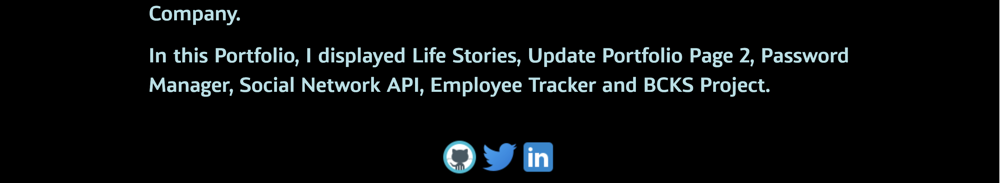
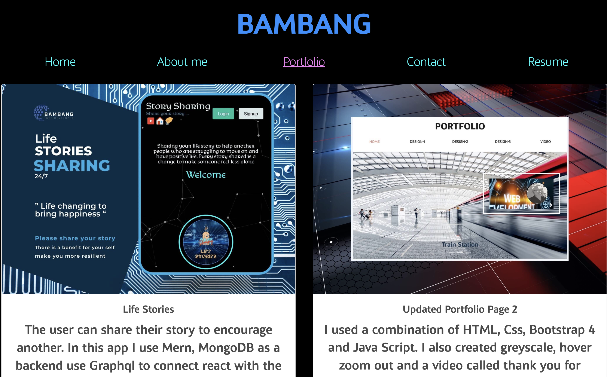
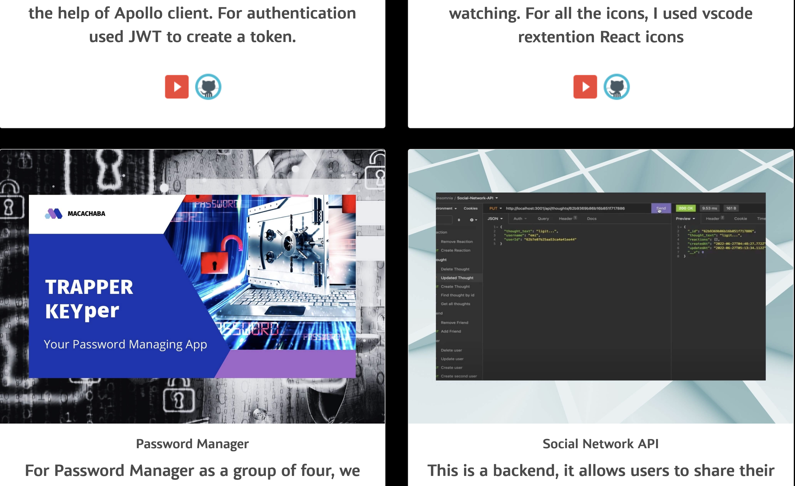
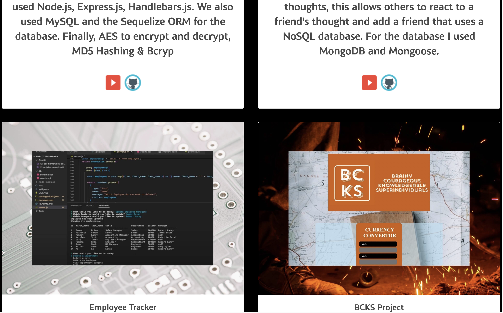
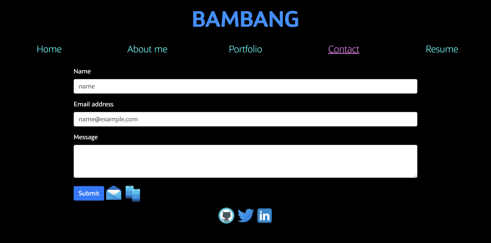
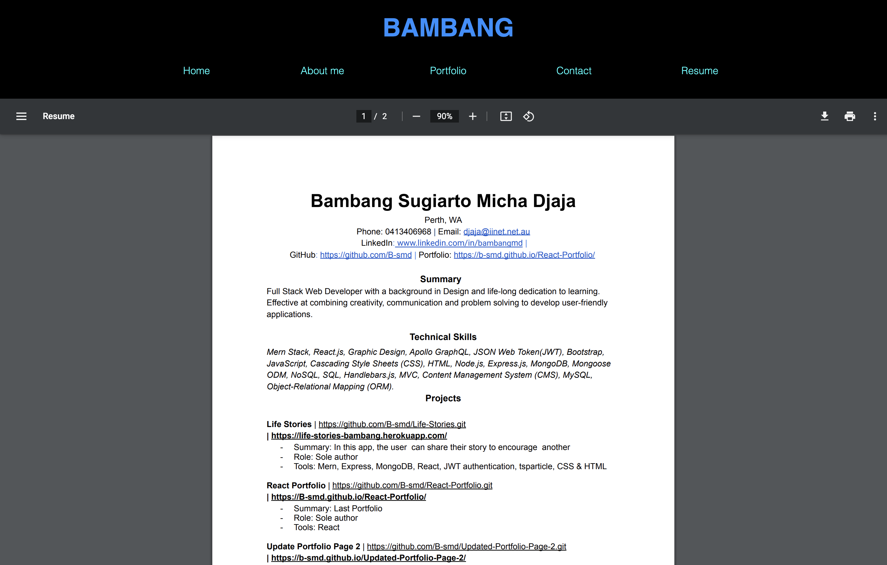

# React Portfolio


  

## Description

This React Portfolio is a single-page application portfolio has a single Header, Navigation and Footer component that appears on multiple pages. When we open the Github page link first appear the homepage, if you want to open About me, Portfolio, Resume and Contact, you can click the link you want to view without change the URl, only change the page. React is used Virtual DOM ( Document Object Model) that make it faster.Bambang Portfolio has display 6 projects: Life Stories, Updated Portfolio Page 2, Password Manager, Social Network API,  Employee Tracker and BCKS Project. This application doesn't include a back-end or connect to an API, so the contact form is not functional. I will add back-end functionality for the future. On the homepage I created tsparticles as a background. 

## Table of Contents (Optional)

- [Installation](#installation)
- [Usage](#usage)
- [Credits](#credits)
- [License](#license)
- [Badges](#badges)
- [Features](#features)
- [Contributing](#contributing)
- [Tests](#tests)
- [Questions](#questions)

## Installation

- Add `homepage` to `package.json`Run:
    "homepage": "https://B-smd.github.io/React-Portfolio".
- Install `gh-pages`. Run:
    `npm install --save gh-pages`.
- Add `deploy` to `script` in `package.json`. Run:
    `"scripts": {
        "predeploy": "npm run build",
        "deploy":  "gh-pages -d build",
        "start": "react-script start",
        "build": "react-script build",
    }`
- Deploy the site by running `npm run deploy`
- For the font I use Adobe font `font-family: kandin, sans-serif`;
   
## Usage

```md
As a user,
WHEN I load the portfolio
THEN I am presented with a homepage containing a header with links, a hero with tsparticles background, and a footer
WHEN I view the header
THEN I am presented with the developer's name and navigation with titles corresponding to different sections of the portfolio
WHEN I view the navigation titles
THEN I am presented with the titles About Me, Portfolio, Contact, and Resume, and the title corresponding to the current section is highlighted
WHEN I click on a navigation title
THEN I am presented with the corresponding section below the navigation without the page reloading and that title is highlighted
WHEN I load the portfolio the first time
THEN the homepage is selected by default
WHEN I am presented with the About Me section
THEN I see a recent photo of the developer and a short bio about them
WHEN I am presented with the Portfolio section
THEN I see titled images of six of the developer’s applications with links to both the deployed applications and the corresponding GitHub repositories
WHEN I am presented with the Contact section
THEN I see a contact form with fields for a name, an email address, and a message
WHEN I am presented with the Resume section
THEN I see a link to a downloadable resume and a list of the developer’s proficiencies
WHEN I view the footer
THEN I am presented with icon links to the developer’s GitHub , Twitter and LinkedIn profiles. 
```

## Demo

- Link demo page: [github](https://b-smd.github.io/React-Portfolio/)











## Credits

- [Simon-Xu-Lan](https://github.com/Simon-Xu-Lan)
- [Sam-Ngu](https://github.com/sam-ngu)


## License
    This application is covered by the MIT license.

---
## Badges


## Features

n/a

## Contributing

Pull request are welcome, you can make a constribution at the bottom of any docs page to make small changes such as a typo, sentence fix or a broken link. For major changes, please open an issue first to discuss what you would like to change.

## Tests

n/a

## Questions

If you have any question, [Email-me](djaja@iinet.net.au) 

Find me on GitHub: [B-smd](https://github.com/B-smd)   


